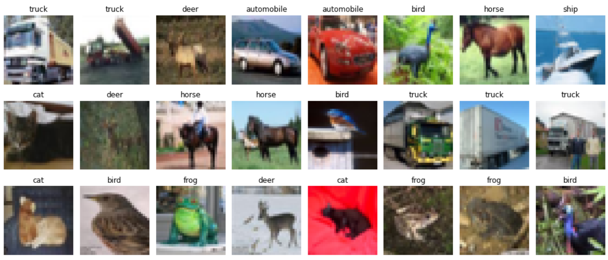
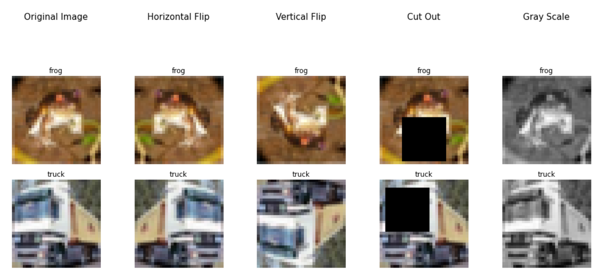
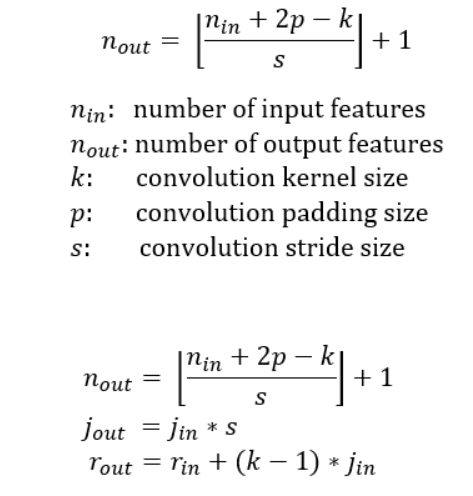
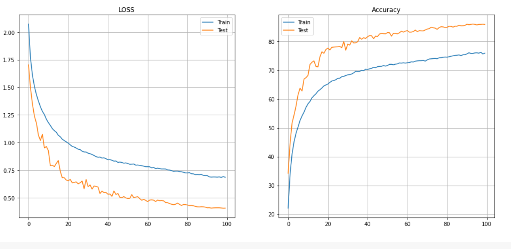

# CIFAR10
 ## A convolution neural network using CIFAR10 dataset
 

- Visualising the downloaded Dataset
- Applying albumentations and then visualising the dataset
- Defining a model 
- Training the model 
- Plotting the accuracy and the loss curve and analysing 

### Visualising the dataset 


### Data Argumentations using albumentation library 
Here we are using few of the data argumentations using the albumentation library like HorizontalFlip, VerticalFlip, CoarseDropout, Grayscale.

``` python
show_images({
    'Original Image': None,
    'Horizontal Flip': A.HorizontalFlip(always_apply=True),
    'Vertical Flip': A.VerticalFlip(always_apply=True),
    'Cut Out': A.CoarseDropout(max_holes=1, max_height=16, max_width=16, min_holes=1, min_height=16, 
                               min_width=16, fill_value=0.473363, mask_fill_value=None, always_apply=True),
    'Gray Scale': A.ToGray(always_apply=True)
})
```
### visualising the data after applying data arguementations



### Model architecture 
``` python 
 Layer (type)               Output Shape         Param #
================================================================
            Conv2d-1           [-1, 32, 32, 32]             864
       BatchNorm2d-2           [-1, 32, 32, 32]              64
              ReLU-3           [-1, 32, 32, 32]               0
           Dropout-4           [-1, 32, 32, 32]               0
            Conv2d-5           [-1, 32, 32, 32]           9,216
       BatchNorm2d-6           [-1, 32, 32, 32]              64
              ReLU-7           [-1, 32, 32, 32]               0
           Dropout-8           [-1, 32, 32, 32]               0
            Conv2d-9           [-1, 64, 30, 30]          18,432
      BatchNorm2d-10           [-1, 64, 30, 30]             128
             ReLU-11           [-1, 64, 30, 30]               0
          Dropout-12           [-1, 64, 30, 30]               0
           Conv2d-13           [-1, 64, 16, 16]           4,096
           Conv2d-14           [-1, 64, 16, 16]           4,096
      BatchNorm2d-15           [-1, 64, 16, 16]             128
             ReLU-16           [-1, 64, 16, 16]               0
          Dropout-17           [-1, 64, 16, 16]               0
           Conv2d-18           [-1, 64, 16, 16]             640
           Conv2d-19           [-1, 64, 16, 16]           4,160
      BatchNorm2d-20           [-1, 64, 16, 16]             128
             ReLU-21           [-1, 64, 16, 16]               0
           Conv2d-22           [-1, 32, 16, 16]          18,432
      BatchNorm2d-23           [-1, 32, 16, 16]              64
             ReLU-24           [-1, 32, 16, 16]               0
          Dropout-25           [-1, 32, 16, 16]               0
           Conv2d-26             [-1, 32, 8, 8]           9,216
      BatchNorm2d-27             [-1, 32, 8, 8]              64
             ReLU-28             [-1, 32, 8, 8]               0
          Dropout-29             [-1, 32, 8, 8]               0
           Conv2d-30             [-1, 24, 8, 8]           6,912
      BatchNorm2d-31             [-1, 24, 8, 8]              48
             ReLU-32             [-1, 24, 8, 8]               0
           Conv2d-33             [-1, 24, 8, 8]             240
           Conv2d-34             [-1, 24, 8, 8]             600
      BatchNorm2d-35             [-1, 24, 8, 8]              48
             ReLU-36             [-1, 24, 8, 8]               0
          Dropout-37             [-1, 24, 8, 8]               0
           Conv2d-38             [-1, 16, 4, 4]           3,456
      BatchNorm2d-39             [-1, 16, 4, 4]              32
             ReLU-40             [-1, 16, 4, 4]               0
          Dropout-41             [-1, 16, 4, 4]               0
           Conv2d-42             [-1, 16, 4, 4]           2,304
      BatchNorm2d-43             [-1, 16, 4, 4]              32
             ReLU-44             [-1, 16, 4, 4]               0
          Dropout-45             [-1, 16, 4, 4]               0
           Conv2d-46             [-1, 10, 4, 4]           1,440
        AvgPool2d-47             [-1, 10, 1, 1]               0
================================================================
Total params: 84,904
Trainable params: 84,904
Non-trainable params: 0
----------------------------------------------------------------
  
```
### Model parameters calculation 


| OPERATION |	N<sub>in</sub> |	N<sub>out</sub> |	CH<sub>in</sub> |	CH<sub>out</sub> |	Padding	| Kernel |	Stride	| j<sub>in</sub> |	j<sub>out</sub>	| r<sub>in</sub> |	r<sub>out</sub> |
| :-------: | :-------: | :-------: | :-------: | :-------: | :-------: | :-------: | :-------: | :-------: | :-------: | :-------: | :-------: |
| **CONVOLUTION 1** |	32 | 32 | 32 | 32 | 1 | 3 | 1 | 1 | 1 | 1 | 3 | 
| **CONVLUTION 2** |	32 | 32 | 32 | 32 | 1 | 3 | 1 | 1 | 1 | 3 | 5 |
| **CONVOLUTION 3**|	32 | 30 | 32 | 64 | 0 | 3 | 1 | 1 | 1 | 5 | 7 |
| **CONVOLUTIONPool** |	30 | 16 | 64 | 64 | 1 | 1 | 2 | 1 | 2 | 7 | 7 |
| **CONVOLUTION 5** |	16 | 16 | 64 | 64 | 0 | 1 | 1 | 2 | 2 | 7 | 7 |
| **CONVOLUTION 6depthwise** |	16 | 16 | 64 | 64 | 1 | 3 | 1 | 2 | 2 | 7 | 11 |
| **CONVOLUTION 7Pointwise** |	16	 | 16 | 64 | 64	| 0	| 1	| 1	| 2 |	2	| 11 |  11 |
| **CONVOLUTION 8 dilated**  |  16  | 16  |	64 | 32	| 2	| 3	| 1 |	2 |	2 |	11 |	15 |
| **CONVLUTION 9** |  16  | 8  |	32 | 32	| 1	| 3	| 2 |	2 |	4 |	15 |	23 |
| **CONVLUTION 10** |  8 | 8  |	32 | 24	| 1	| 3	| 1 |	4 |	4 |	23 |	31 |
| **CONVLUTION 11depth** |  8 | 8  |	24 | 24	| 1	| 3	| 1 |	4 |	4 |	31 |	39 |
| **CONVLUTION 12point** |  8 | 8  |	24 | 24	| 0 | 1	| 1 |	4 |	4 |	39 |	39 |
| **CONVLUTION 13** |  8 | 4  |	24 | 16	| 1 | 3	| 2 |	4 |	8 |	39 |	47 |
| **CONVLUTION 14** |  4 | 4  |	16 | 16	| 1 | 3	| 1 |	8 |	8 |	47 |	63 |
| **CONVLUTION 14** |  4 | 4  |	16 | 10	| 1 | 3	| 1 |	8 |	8 |	63 |	79 |

Analysis :
With a total of 84,904 parameters the model reached an accuracy of 85.9% within 100 epochs. 

## Loss and Accuracy Curve


