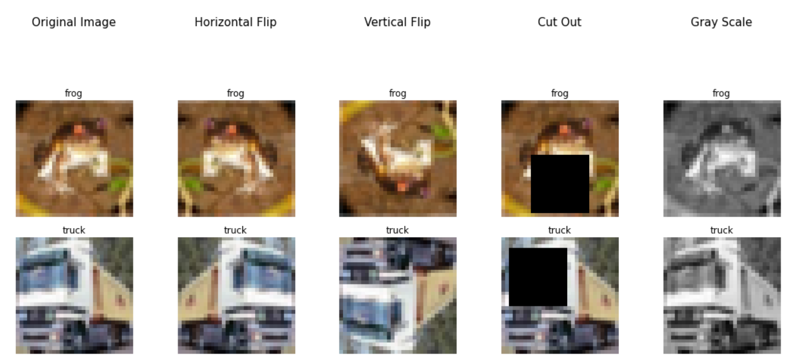

# CIFAR10
 ## A convolution neural network using CIFAR10 dataset
 

- Visualising the downloaded Dataset
- applying albumentations and then visualising the dataset
- defining a model 
- training the model 
- plotting the accuracy and the loss curve and analysing 

### Visualising the dataset 


### Data Argumentations using albumentation library 
Here we are using few of the data argumentations using the albumentation library like HorizontalFlip, VerticalFlip, CoarseDropout, Grayscale.

``` python
show_images({
    'Original Image': None,
    'Horizontal Flip': A.HorizontalFlip(always_apply=True),
    'Vertical Flip': A.VerticalFlip(always_apply=True),
    'Cut Out': A.CoarseDropout(max_holes=1, max_height=16, max_width=16, min_holes=1, min_height=16, 
                               min_width=16, fill_value=0.473363, mask_fill_value=None, always_apply=True),
    'Gray Scale': A.ToGray(always_apply=True)
})
```
### visualising the data after applying data arguementations



### Model architecture 
``` python 
  
```
### Model parameters calculation 

| OPERATION |	N<sub>in</sub> |	N<sub>out</sub> |	CH<sub>in</sub> |	CH<sub>out</sub> |	Padding	| Kernel |	Stride	| j<sub>in</sub> |	j<sub>out</sub>	| r<sub>in</sub> |	r<sub>out</sub> |
| :-------: | :-------: | :-------: | :-------: | :-------: | :-------: | :-------: | :-------: | :-------: | :-------: | :-------: | :-------: |
| **CONVLUTION 1** |	28 | 26	| 1	 | 8	| 0	| 3	| 1 | 1	| 1 |	1  |  3  |
| **CONVLUTION** |	26 | 24	| 8	 | 16 |	0	| 3	| 1	| 1 |	1 |	3  |	5  |
| **MaxPool**    |	24 | 12 |	16 | 16	| 0 |	2	| 2	| 1 |	2 | 5  |	6  |
| **CONVLUTION** |	12 | 12 | 16 |	8	| 0 |	1 |	1	| 2	| 2 |	6  |	6  |
| **CONVLUTION** |	12 | 10 |	8	 | 12	| 0 | 3 |	1	| 2	| 2 |	6  |	10 |
| **CONVLUTION** |	10 | 8  |	12 | 16 | 0 | 3 |	1	| 2	| 2	| 10 |	14 |
| **CONVLUTION** |	8	 | 6  | 16 | 20	| 0	| 3	| 1	| 2 |	2	| 14 |  18 |
| **GAP**        |  6  | 1  |	20 | 20	| 0	| 6	| 1 |	2 |	2 |	18 |	28 |
| **CONVLUTION** |	1	 | 1  |	20 | 16	| 0	| 1	| 1	| 2	| 2	| 28 |  28 |
| **CONVLUTION** |	1	 | 1  |	16 | 10	| 0	| 1 |	1	| 2	| 2	| 28 |	28 |


