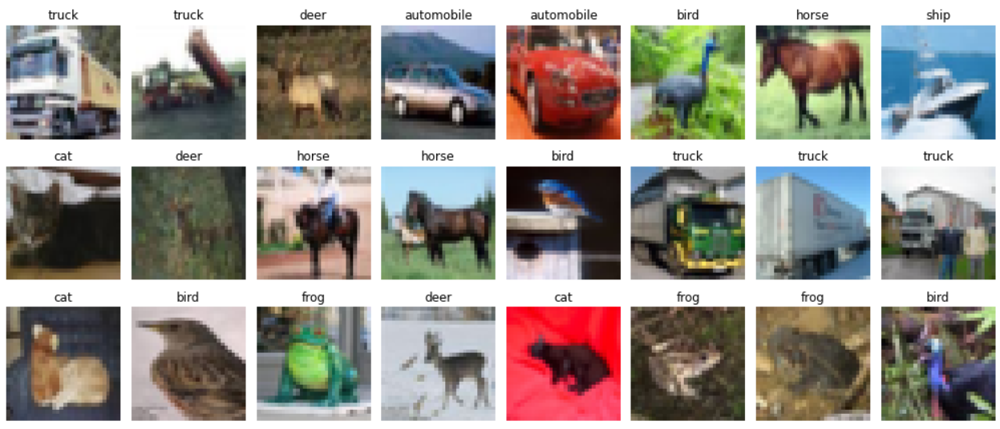

# CIFAR10
 ## A convolution neural network using CIFAR10 dataset
 

- Visualising the downloaded Dataset
- applying albumentations and then visualising the dataset
- defining a model 
- training the model 
- plotting the accuracy and the loss curve and analysing 

### Visualising the dataset 


### Data Argumentations using albumentation library 
``` python
show_images({
    'Original Image': None,
    'Horizontal Flip': A.HorizontalFlip(always_apply=True),
    'Vertical Flip': A.VerticalFlip(always_apply=True),
    'Cut Out': A.CoarseDropout(max_holes=1, max_height=16, max_width=16, min_holes=1, min_height=16, 
                               min_width=16, fill_value=0.473363, mask_fill_value=None, always_apply=True),
    'Gray Scale': A.ToGray(always_apply=True)
})
```
### visualising the data after applying data arguementations


### Model architecture 
``` python 
  
```
### Model parameters calculation 

